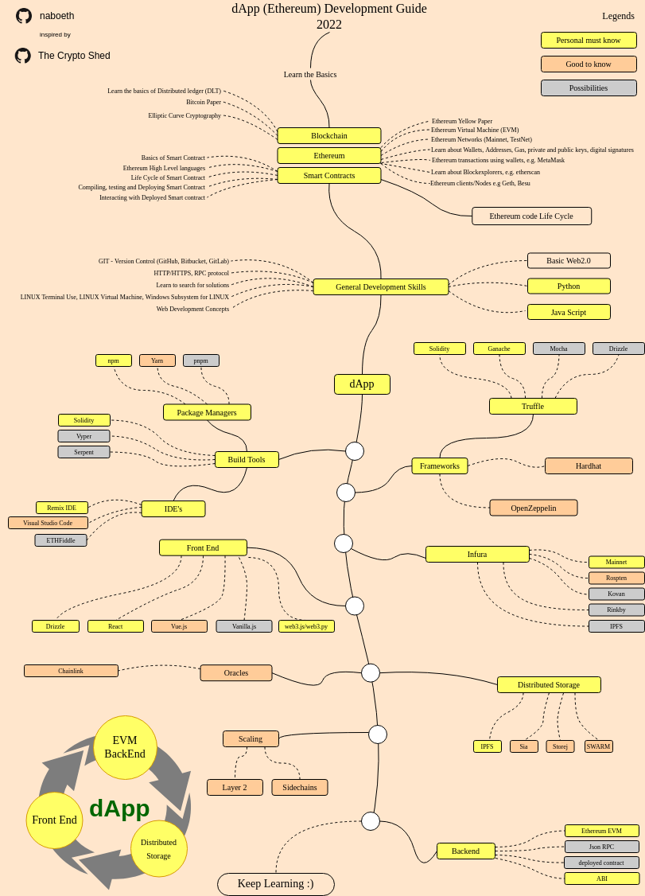

# dApp Developer Roadmap

> Roadmap to becoming a dApp developer in 2022:
Below you can find a chart demonstrating the paths that you can take and the libraries that you would want to learn to become a dApp developer. I made this chart as a tip for everyone who asks me, "What should I learn to be a dApp Developer and where to start?"

## Disclaimer
> The purpose of this roadmap is to give you an idea about the landscape. The road map will guide you if you are confused about what to learn next, rather than encouraging you to pick what is hip and trendy. You should grow some understanding of why one tool would be better suited for some cases than the other and remember hip and trendy does not always mean best suited for the job

## Inspired By
> This repository is inspired by [react Developer Roadmap](https://github.com/adam-golab/react-developer-roadmap) and [dApp developer Roadmap 2019](https://github.com/thecryptoshed/eth-dapp-developer-roadmap)

## Roadmap

## Resources

1. Basics
    1. Blockchain
        * Learn the basics of Distributed Ledger Technology (DLT)
        * [Bitcoin protocol](https://medium.com/coinmonks/bitcoin-white-paper-explained-part-1-4-16cba783146a)
        * [Elliptic Curve Cryptography](https://medium.com/coinmonks/learn-how-to-code-elliptic-curve-cryptography-a952dfdc20ab)
    2. Ethereum
        * Learn the basics of Ethereum
        * [Ethereum Yellow Paper](https://ethereum.github.io/yellowpaper/paper.pdf) 
        * Ethereum Virtual Machine (EVM)-- turing complete
        * Learn about Wallets, Accounts (EOA), Private/Public Keys, Digital Signatures
        * Learn about transactions, Gas, Metamask
        * Ethereum clients/Nodes: Geth, Besu
        * Infura infrastructure
    3. Smart Contract
        * Basics of Smart Contract
        * Life Cycle of Smart Contract
        * Ethereum Higher Level languages (**Solidity**, Vyper, Serpent)
        * Compiling, deploying, testing smart Contracts
        * Interacting with smart contracts using [web3.js](https://livecodestream.dev/post/interacting-with-smart-contracts-from-web-apps/), web3.py or ether.js
2. General Development Skills
    1. Learn [GIT](https://medium.com/pixel-pioneers/the-basics-of-version-control-system-git-explained-by-designing-a-new-car-3fb3a10e9e40), create a few repositories on [GitHub](https://github.com/) / [GitLab](https://about.gitlab.com/), share your code with other people
    2. Know HTTP(S) protocol, request methods (GET, POST, PUT, PATCH, DELETE, OPTIONS)
    3. Don't be afraid of using Google, [Power Searching with Google](http://www.powersearchingwithgoogle.com/)
    4. Get familiar with terminal ([Linux/Docker](https://medium.com/coinmonks/how-to-become-a-blockchain-developer-59c830e20f15)), configure your shell (bash, zsh, fish)
    5. Learn about [algorithms and data structures](https://www.youtube.com/c/theroadmap/featured)
    6. Web Development Concepts
3. Learn React on [official website](https://reactjs.org/tutorial/tutorial.html) or complete some [courses](https://egghead.io/courses/the-beginner-s-guide-to-react) (for beginners some basic HTML and vanilla.js should be sufficient)
4. Get familiar with tools that you will be using
    1. Package Managers
        * [npm](https://www.npmjs.com/)
        * [yarn](https://yarnpkg.com/lang/en/)
        * [pnpm](https://pnpm.js.org/)
    2. IDE's
        * [Remix IDE](https://remix.ethereum.org/)
        * [Visual Studio Code](https://code.visualstudio.com/docs/setup/setup-overview)
        * [Ethfiddle](https://ethfiddle.com/)
    * [Solidity](https://docs.soliditylang.org/en/latest/)
    * [Vyper](https://github.com/ethereum/vyper)
5. Frameworks
    1. Truffle Suit
        * [Truffle](https://truffleframework.com/truffle)
        * [Ganache](https://truffleframework.com/ganache)
        * [Drizzle](https://truffleframework.com/drizzle)
        * [Tutorials](https://trufflesuite.com/tutorial/)
        * [Boxes](https://trufflesuite.com/boxes/)
        * [Truffle Under the Hood](https://medium.com/heartbankacademy/how-truffle-works-under-the-hood-f1ff6add416c)
    2. Hardhat
        * [Hardhat](https://hardhat.org/)
        * [Tutorial](https://www.youtube.com/playlist?list=PLw-9a9yL-pt3sEhicr6gmuOQdcmWXhCx4)
    3. Infura (A Gateway to Ethereum)
        * [Mainnet End Point](https://infura.io/)
        * [Ropsten TestNet End Point](https://infura.io/)
        * [Kovan TestNet End Point](https://infura.io/)
        * [Rinkby TestNet End Point](https://infura.io/)
        * [IPFS](https://medium.freecodecamp.org/hands-on-get-started-with-infura-and-ipfs-on-ethereum-b63635142af0)
    4. Interacting with Smart Contract
        * [Web3.js](https://web3js.readthedocs.io/en/1.0/)
        * [Web3.py](https://web3py.readthedocs.io/en/stable/)
        * [ether.js](https://docs.ethers.io/v5/)
    5. Python Ethereum Eco System
        * [Article](https://medium.com/@pipermerriam/the-python-ethereum-ecosystem-101bd9ba4de7)
6. [Distributed Storage Systems](https://medium.com/bitfwd/what-is-decentralised-storage-ipfs-filecoin-sia-storj-swarm-5509e476995f)
    1. [IPFS](https://ipfs.io/)
    2. [SWARM](https://swarm-gateways.net/)
    3. [Storej](https://storj.io/)
    4. [Sia](https://sia.tech/)
7. Oracles
    * [Chainlink](https://ens.domains/)
8. Scaling
    * [Layer 2](https://ethereum.org/en/layer-2/)
    * [Sidechains](https://ethereum.org/en/developers/docs/scaling/sidechains/)
9. Front End App
    * [React / React Native](https://truffleframework.com/tutorials/drizzle-and-react-native)
    * [React Roadmap](https://github.com/adam-golab/react-developer-roadmap)
    

## Further Readings

### Recommended Articles
   1. [Awesome Ethereum Resource Lists](https://medium.com/quiknode/awesome-ethereum-resource-lists-dd28a9c17fc1)
   2. [Comprehensive Ethereum Developer Resource List](https://github.com/ConsenSys/ethereum-developer-tools-list/blob/master/README.md)

### Recommended Libraries
   1. [Solidity Smart Contract Library: OpenZeppeline](https://openzeppelin.org/api/docs/get-started.html)

### Books
   1. [Mastering Ethereum: Building Smart Contracts and DApps](https://www.amazon.com/_/dp/1491971940?tag=oreilly20-20)

### Courses
   1. [Ethereum and Solidity: The Complete Developer's Guide](https://www.udemy.com/ethereum-and-solidity-the-complete-developers-guide/)
   2. [The Phoenix Guild](https://twitter.com/PhoenixGuildHQ)
   3. [ConsenSys Blockchain Developer Online Bootcamp](https://consensys.net/academy/bootcamp/)
        * [The Bigger Pie Getting Started Workshop](https://github.com/The-Bigger-Pie/getting-started-workshop)

### Youtube/Medium Channels & Webpages
   1. [MammothInteractive](https://www.youtube.com/c/MammothInteractive)
   2. [Smart Contract Programmer](https://www.youtube.com/channel/UCJWh7F3AFyQ_x01VKzr9eyA)
   3. [End to End Tutorial Online Marketplace](https://www.ahmetkucukoglu.com/en/developing-blockchain-app-1-create-smart-contract/)

## Wrap Up

If you think the roadmap can be improved, please do open a PR with any updates and submit any issues. Also, I will continue to improve this, so you might want to star this repository to revisit.

## Contribution

The roadmap is built using [Draw.io](https://www.draw.io/). Project file can be found at `/src` directory. To modify it, open draw.io, click **Open Existing Diagram** and choose `xml` file with project. It will open the roadmap for you. Update it, upload and update the images in readme and create a PR (export as png).

- Open a pull request with improvements
- Discuss ideas in issues
- Spread the word

## License

